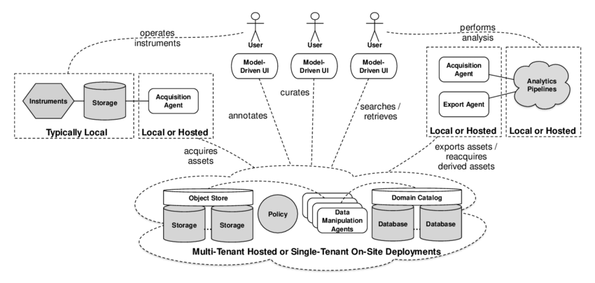
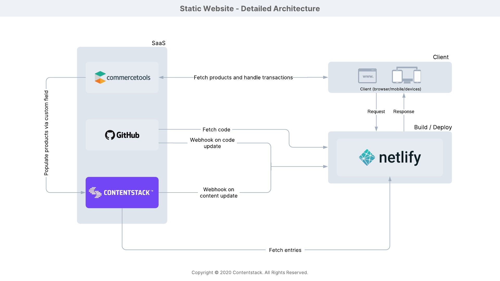
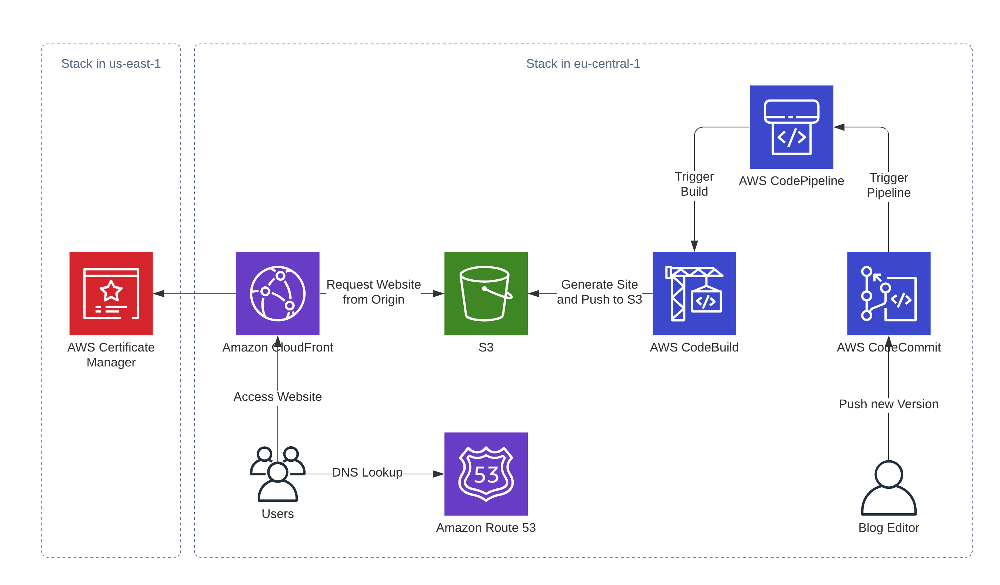
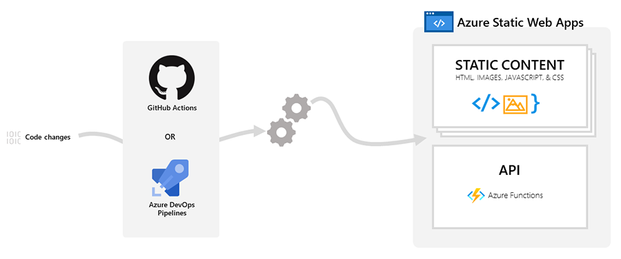

🎨 Digital Brand & Media Asset Management – RUGAYA FILMS

📌 Why This Folder Is Needed

The assets/ directory is responsible for maintaining all static branding and visual resources of the project.

Without this folder:

Branding becomes inconsistent

Media files get scattered

No centralized visual identity

Difficult to scale UI and marketing

No clear separation between code and media

This folder ensures structured Digital Asset Management (DAM).

🎯 Importance of This Folder

The assets/ folder is important because it:

Maintains brand identity consistency

Centralizes logos and media

Separates UI assets from backend logic

Supports frontend design scalability

Prepares project for production deployment

Helps maintain design standards across environments

For a premium brand like RUGAYA FILMS, visual identity is critical.

==================================================================

📂 Typical Structure of assets/
assets/
│
├── logo/
│   ├── rugaya-logo.png
│   ├── rugaya-logo-white.png
│   └── favicon.ico
│
├── images/
│   ├── hero-banner.jpg
│   ├── sample-product.jpg
│
├── screenshots/
│   ├── homepage.png
│   ├── login-page.png
│
└── brand-guidelines.md
⚙️ Working of This Folder

The assets folder:

Stores static resources

Supplies images to frontend

Maintains logo variations

Stores UI screenshots

Keeps brand documentation

Acts as reference for marketing materials

Frontend references these files using:

src="/assets/logo/rugaya-logo.png"
🏗 Asset Architecture Overview
4
🔄 Working Flow
Designer Creates Logo
        ↓
Upload to assets/logo/
        ↓
Frontend Uses Logo in UI
        ↓
Screenshots Stored in assets/screenshots/
        ↓
Used in README & Documentation
        ↓
Deployed with Frontend Build
🛠 Steps to Use This Folder

You do NOT run this folder like code.

Instead:

1️⃣ Add Branding Files

Place all:

Logos

Icons

UI images

Marketing banners

Inside appropriate subfolders.

2️⃣ Reference in Frontend

Example:

3️⃣ Use in Documentation

Example:

4️⃣ Keep Optimized

Before adding images:

Compress using TinyPNG

Use WebP for performance

Maintain consistent naming

Example:

hero-banner.webp
product-portrait-01.webp
🚀 Best Practices
🔹 Use SVG for logos (scalable)
🔹 Maintain black-gold theme consistency
🔹 Do not store large production images here (use S3)
🔹 Keep production media separate from development samples
🔹 Add versioning if branding changes
🔐 Production Suggestion

In production:

Frontend static assets → Served via Nginx

Heavy media files → Stored in AWS S3

CDN (CloudFront) → For global distribution

This improves:

Performance

Scalability

Cost optimization

🧠 Professional Upgrade Idea

You can enhance this folder by:

Adding design-system.md

Adding color-palette.json

Adding typography-guide.md

Adding UI mockups (Figma exports)

Adding marketing media kit

🎬 Final Impact

With proper asset management:

Brand becomes consistent

UI stays professional

Marketing becomes easier

Project looks enterprise-grade

GitHub portfolio looks premium

