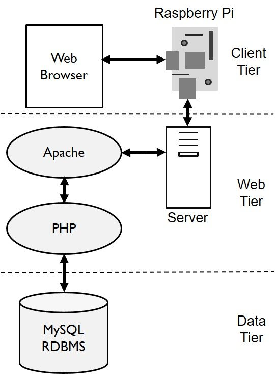
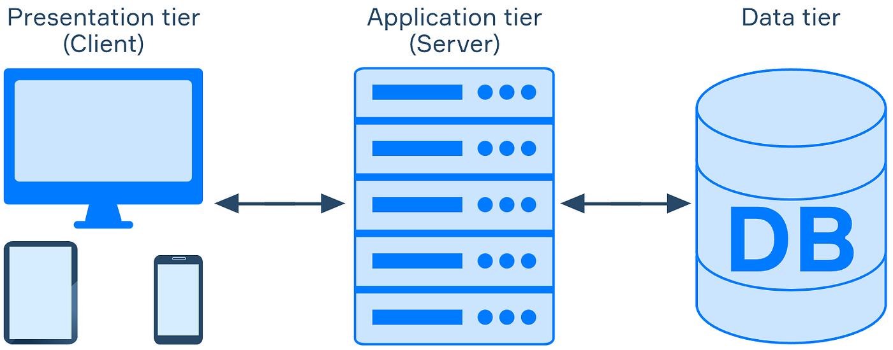
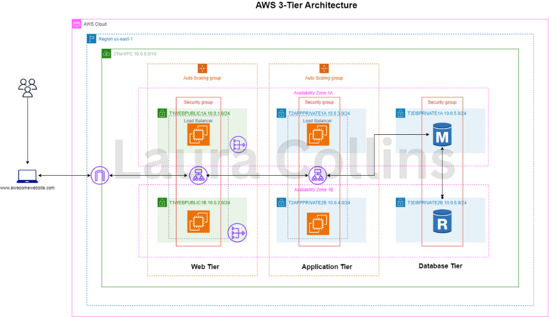
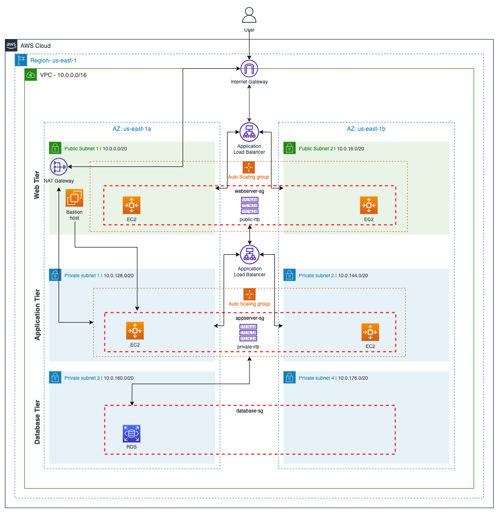

🏗 Three-Tier Application Architecture – RUGAYA FILMS
📌 Why Three-Tier Architecture Is Needed

The Three-Tier Architecture is used to separate concerns within the application.

Without this separation:

Code becomes tightly coupled

Scaling becomes difficult

Security risks increase

Maintenance becomes complex

Cloud migration becomes harder

Three-tier architecture ensures the system is:

Modular

Scalable

Secure

Maintainable

Cloud-ready

🎯 Importance of Three-Tier Architecture

This architecture enables:

🔐 Strong security boundaries

📈 Independent scaling of layers

🧱 Clean separation of responsibilities

☁️ Cloud-native deployment

🐳 Containerization readiness

🧠 Easier DevOps integration

It is a standard used in enterprise-grade web applications.

🏗 Three-Tier Architecture Overview
4
🧱 The Three Layers Explained
1️⃣ Presentation Layer (Frontend)

📍 Location: frontend/
📍 Technology: React + Tailwind

Responsibilities:

UI rendering

User interaction

API calls

Authentication token storage

Displaying products

This layer does NOT:

Access database directly

Handle business logic

Store sensitive credentials

2️⃣ Application Layer (Backend)

📍 Location: backend/
📍 Technology: Node.js + Express

Responsibilities:

Authentication (JWT)

Role-based access control

Business logic

API endpoints

S3 image upload

Database queries

This layer acts as the brain of the system.

3️⃣ Data Layer (Database + Storage)

📍 Location: database/
📍 Technology: PostgreSQL + AWS S3

Responsibilities:

Store users

Store products

Store image URLs

Maintain relational integrity

Ensure persistence

Database never communicates directly with frontend.

🔄 End-to-End Working Flow
User Opens Website
        ↓
React Frontend Loads
        ↓
User Performs Action (Login / View Product)
        ↓
API Request Sent to Backend
        ↓
Backend Validates JWT (if required)
        ↓
Backend Queries PostgreSQL
        ↓
Backend Retrieves Image from S3 (if needed)
        ↓
Response Sent to Frontend
        ↓
Frontend Updates UI
☁️ Three-Tier Deployment on AWS

Presentation Layer:

EC2 → React via Nginx

Application Layer:

EC2 → Node.js backend

Data Layer:

RDS → PostgreSQL

S3 → Image storage

🛠 How to Run 3-Tier Setup Locally
1️⃣ Start Database
docker-compose up postgres

OR start local PostgreSQL.

2️⃣ Start Backend
cd backend
npm install
npm run dev
3️⃣ Start Frontend
cd frontend
npm install
npm run dev
🐳 How to Run Using Docker (Full 3-Tier)
docker-compose up --build

Frontend:

http://localhost:3000

Backend:

http://localhost:5000
🔐 Security Benefits of Three-Tier Design

Frontend cannot access DB directly

Backend validates every request

JWT protects routes

Role-based admin protection

DB can be placed in private subnet

Secrets handled via environment variables

📈 Scalability Benefits

You can independently scale:

Frontend pods (Kubernetes)

Backend pods

Database instance

S3 storage

Example:

Add Load Balancer

Enable Auto Scaling Group

Add read replicas

🧠 Suggested Improvements

Future architectural upgrades:

Add API Gateway

Add Redis caching layer

Add CDN (CloudFront)

Add Microservices split

Move to Kubernetes (EKS)

Use Terraform for IaC

🚀 DevOps Alignment

Three-tier architecture integrates with:

CI pipeline

Docker containerization

EC2 deployment

Kubernetes orchestration

Infrastructure as Code

Monitoring & Logging

🏆 Final Summary

The Three-Tier Architecture ensures RUGAYA FILMS is:

Modular

Secure

Cloud-ready

DevOps-aligned

Production scalable

It is the foundation of enterprise-grade SaaS applications.