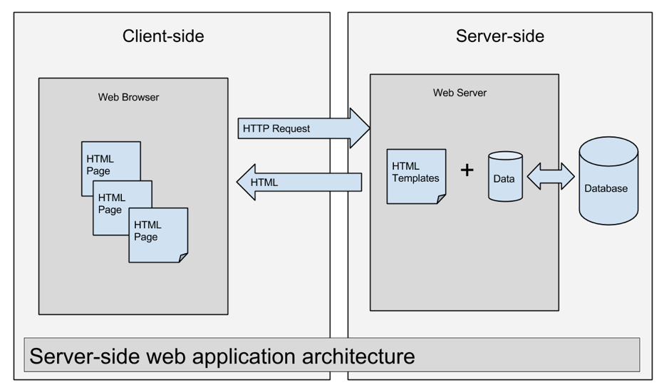
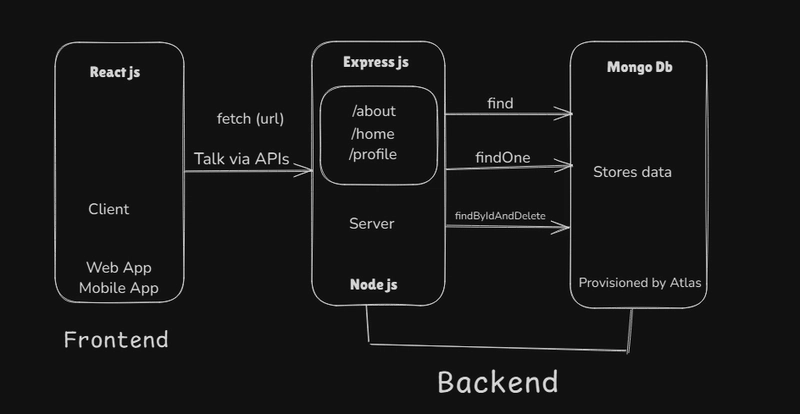
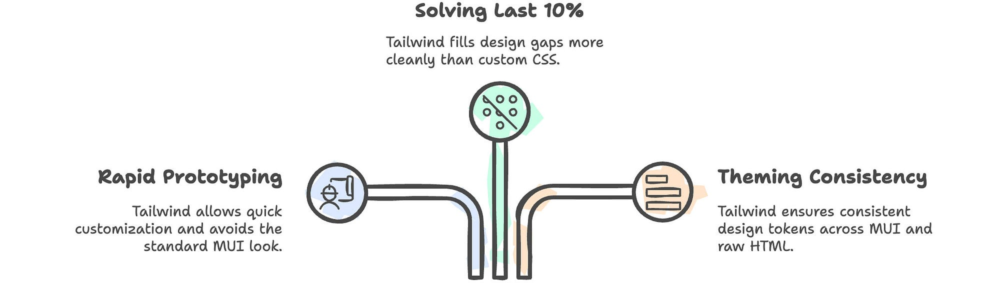
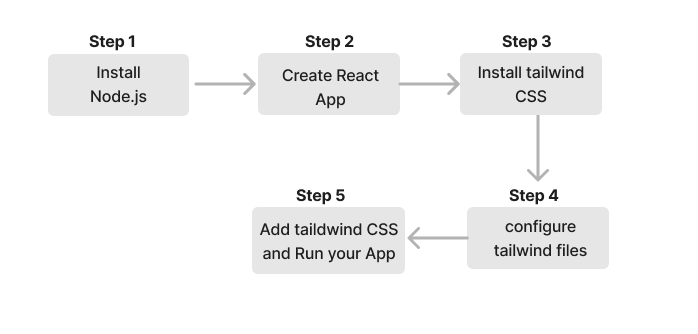

🎬 Presentation Layer – RUGAYA FILMS
📌 Why This Layer Is Needed

The Presentation Layer is responsible for delivering the user interface and user experience of RUGAYA FILMS.

Without this layer:

Users cannot interact with the platform

No product visualization

No authentication interface

No brand identity experience

No e-commerce interaction

This layer transforms backend data into a premium cinematic visual experience.

🎯 Importance of This Layer

The Frontend ensures:

🎨 Luxury black-gold branding consistency

👤 Smooth user authentication experience

🛒 Product browsing and viewing

📱 Responsive design across devices

🔄 Real-time API communication

⚡ Optimized performance

It represents the public face of the application.

🏗 Frontend Architecture Overview
4
📂 Frontend Folder Structure
frontend/
│
├── public/
├── src/
│   ├── components/
│   ├── pages/
│   ├── services/
│   ├── App.jsx
│   ├── main.jsx
│   └── index.css
│
├── package.json
├── tailwind.config.js
└── vite.config.js
⚙️ Technology Stack

⚛ React (Vite)

🎨 Tailwind CSS

🌐 React Router

🔗 Fetch API

🐳 Docker (Production)

☁️ Nginx (Production Serving)

🔄 Working Flow
User Opens Website
        ↓
React Loads SPA
        ↓
User Performs Action (Login / View Products)
        ↓
API Call Sent to Backend
        ↓
Backend Processes Request
        ↓
Response Returned
        ↓
UI Updates Dynamically
🔐 Authentication Flow

User submits login form

Backend validates credentials

JWT token returned

Token stored in localStorage

Token sent in Authorization header

Protected routes unlocked

🛠 Steps to Run Frontend (Development Mode)
1️⃣ Install Dependencies
cd frontend
npm install
2️⃣ Start Development Server
npm run dev

Open:

http://localhost:5173
🐳 Run Frontend via Docker

From root folder:

docker-compose up --build

Access:

http://localhost:3000
🎨 Branding & Theme

Primary Theme:

Background: #0f0f0f

Accent Gold: #d4af37

Typography: Modern minimal

Style: Cinematic, Luxury, Minimal

Tailwind configuration extends:

colors: {
  gold: "#d4af37",
  darkbg: "#0f0f0f",
}
🚀 Production Deployment Flow

React builds static files

Docker builds production image

Nginx serves static files

EC2 hosts container

Backend API connected

Images loaded from S3

📈 Performance Optimization Suggestions

Use WebP images

Enable lazy loading

Enable code splitting

Add image CDN (CloudFront)

Add caching headers

Minify assets in production

🔐 Security Considerations

Never store secrets in frontend

Use HTTPS in production

Validate user input

Implement protected routes

Enable CORS properly

🧠 Suggested Future Enhancements

Add Admin Dashboard UI

Add Product Upload Interface

Add Booking System

Add Cart & Checkout

Add Dark / Light Toggle

Add Toast Notifications

Add State Management (Redux / Zustand)

🎬 Role in DevOps Lifecycle

Frontend integrates with:

CI pipeline (build validation)

Docker containerization

EC2 deployment

Kubernetes pod scaling

CDN distribution

Monitoring & logging tools

🏆 Final Summary

The Presentation Layer is the visual identity and interaction engine of RUGAYA FILMS.

It ensures:

Premium user experience

Secure authentication interface

Scalable architecture

Production-ready deployment

Brand consistency